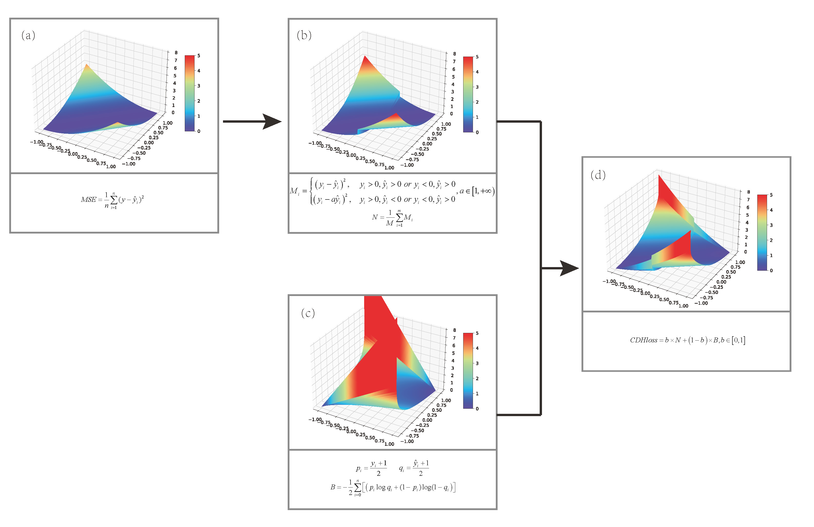

# Directional mixed regression loss function for stock forecasting
## Abstract
In the conventional stock price prediction model, stock price fluctuations are typically forecasted only as regression values or treated as a binary classification problem for predicting the direction of price movements. However, these models often overlook the relationship between the magnitude of price changes and the direction of those changes, leading to significant discrepancies from the actual market conditions. To address this issue, this study introduces a novel mixed regression loss function called Considering Direction Hybrid Loss (CDHloss) that takes into account both the magnitude and direction of price movements. By amplifying the traditional mean square error in the direction of inconsistent signs, and combining it with the classification cross-entropy loss, the proposed function penalizes discrepancies between predicted and actual outcomes, thereby enhancing the model’s ability to converge towards the correct solution. Moreover, Bayesian multi-objective optimization is employed to determine the optimal weight in calculating CDHloss. The theoretical analysis of the gradient and convergence of the loss function is presented in this paper. Experimental results demonstrate that the Bayesian-optimized CDHloss outperforms MSE and MAE loss functions, yielding a 2\%-19\% improvement in Accuracy and a 0.02 to 0.46 increase in F1-score for predicting stock price movements. Furthermore, comparative evaluations with other prediction models reveal the superior performance of CDHloss across all evaluation metrics, even surpassing neural network methods that solely predict price directions. Robustness tests further confirm the effectiveness of CDHloss in stock forecasting, showcasing its strong predictive performance and stability. In conclusion, CDHloss emerges as a promising approach for accurate and robust stock price prediction.

## File Structure
1. StockLossAndMetrics.py: Definition of CDHloss and evaluation metrics
2. Net.py: Construction of models used in training
3. train.py: Training of stock models using MSE, MAE, and CDHloss, with results exported to log_train.txt
4. train_MOBOpt.py: Multi-objective Bayesian optimization of CDHloss, with results exported to log_opt.txt
5. train_zs.py: Training of index models using MSE, MAE, and CDHloss, with results exported to log_train.txt
6. train_MOBOpt_zs.py: Multi-objective Bayesian optimization of CDHloss for index models, with results exported to log_opt.txt
7. imgLoss.py: Illustration of CDHloss
8. data: Directory containing stock and index data